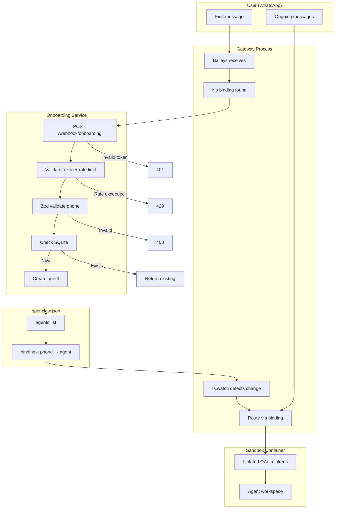

# DonClaudioBot v2 - Architecture Reference
**Version:** 2.14.0 | **Status:** Production Ready | **Updated:** 2026-02-04

---

## Executive Summary
DonClaudioBot is a WhatsApp-based multi-user AI assistant service where each user gets a sandboxed agent with Google OAuth (Gmail/Calendar). This is v2 — a complete redesign of Clawd4All that fixes the timing problem where OAuth happened before sandbox creation.

**v2 Key Fix:** Create agents with sandbox config FIRST, then do OAuth in that agent's context. OpenClaw is used as an npm dependency (not fork), and agents are created dynamically (no pre-provisioning). Onboarding is a deterministic Node.js service with SQLite state tracking, not LLM-driven instructions.

**Key Architecture Change (v2.14.0):** Dual-process launcher runs Gateway via `npx openclaw gateway` (not npm import) and Onboarding via `node dist/index.js`. See "Dual-Process Architecture" section below.

---

## Onboarding Flow

1. Unknown WhatsApp message received (Baileys sidecar listeners)
2. Baileys calls `POST /webhook/onboarding` with phone number
3. **Webhook layer:** HOOK_TOKEN validation (401 if invalid) → Rate limit check: 10 req/15min per IP (429 if exceeded)
4. **Validation layer:** Zod validates E.164 phone format (400 if invalid)
5. **Idempotency check:** SQLite queried for existing state — returns existing agentId with 200 if found
6. **Agent creation:** Generate unique agentId (`user_<16hex>`) and GOG_KEYRING_PASSWORD (32 bytes base64url)
7. **Config update (atomic):** Backup openclaw.json → Add agent + binding → proper-lockfile ensures single writer
8. **Gateway reload:** `fs.watch()` detects config change → auto-reloads (no manual reload needed)
9. **Database write:** Insert with UNIQUE constraint on phone_number — handles race conditions from concurrent requests
10. User gets dedicated agent with Google OAuth prompt

**API Endpoints:**
- `POST /webhook/onboarding` — Triggers agent creation (protected by HOOK_TOKEN)
- `GET /onboarding/state/:phone` — Get current onboarding status
- `POST /onboarding/update` — Update user details (name, email)
- `POST /onboarding/handover` — Transition to 'completed' status

**Error Responses:**
- `401 Unauthorized` — Invalid HOOK_TOKEN
- `403 Forbidden` — Missing HOOK_TOKEN
- `400 Bad Request` — Invalid phone format or security violation
- `429 Too Many Requests` — Rate limit exceeded (10 req/15min)

### State Transitions

```
NEW → PENDING_WELCOME → COLLECTING_INFO → READY_FOR_HANDOVER → COMPLETE → ACTIVE
  ↓                                    ↓
ALREADY_ONBOARDED                  CANCELLED
```

| Status | Description | Next States |
|--------|-------------|-------------|
| `new` | Initial state, agent created | `pending_welcome` |
| `pending_welcome` | Welcome message queued | `collecting_info` |
| `collecting_info` | Gathering name/email | `ready_for_handover`, `cancelled` |
| `ready_for_handover` | Awaiting user message | `complete` |
| `complete` | Handover done | `active` |
| `active` | Normal operation | — (terminal) |
| `cancelled` | User abandoned | — (terminal) |

### Error Handling Strategy

The onboarding flow has 4 atomic steps: CLI call → config update → gateway reload → database write. If any step fails, rollback in reverse order.

| Failure Mode | Severity | Recovery |
|--------------|----------|----------|
| CLI call fails (OpenClaw not installed) | Critical | Abort - Return error to user |
| Agent ID already exists | High | Idempotent - Return existing agent |
| Config file locked | High | Retry with backoff (1s, 2s, 5s) |
| Config write fails (disk full) | Critical | Rollback - Delete agent, alert ops |
| Gateway reload fails | High | Rollback - Remove from config, delete agent |
| Database write fails | Critical | Rollback - Remove config, delete agent |
| UNIQUE violation (phone) | High | Idempotent - Return existing agent |
| Container crash mid-onboarding | High | Reconciliation - Cleanup job on restart |

**Transactional Pattern:** Flags track `agentCreated` and `configUpdated`. On error: restore config backup (if updated), then `openclaw agents remove` (if created).

---

## Why No Onboarding Agent?

The config template has **zero default agents** and **zero channel-level bindings**. This is intentional.

**Problem**: OpenClaw sessions are "sticky" — once a session is created (e.g., `agent:onboarding:whatsapp:dm:+1555...`), it persists until `/new`, `/reset`, or daily expiry at 4:00 AM. If a user's first message routes to an "onboarding" catch-all agent before the webhook creates their dedicated agent, that session sticks and the user is trapped in the wrong agent.

**Solution**: No catch-all agent exists. The webhook creates the dedicated agent + binding before the message routes. If the webhook is slow and the first message is dropped, the user retries naturally — and by then the binding exists.

| Scenario | Behavior |
|----------|----------|
| Normal (webhook fast) | Binding added → message routes to dedicated agent |
| Webhook slow | No binding → message dropped (no response) |
| User messages again | Binding exists → routes to dedicated agent |

This trades a possible dropped first message for guaranteed correct routing on all subsequent messages.

---

## Language & Template Routing

New users receive language-appropriate agent templates based on their phone number's country code.

**Config**: `config/phone-language-map.json` maps country codes to template folders:
```json
{ "1": "dedicated-en", "44": "dedicated-en", "56": "dedicated-es", ... }
```

**Detection**: `onboarding/src/lib/language-detector.ts` extracts the country code from E.164 phone numbers using longest-prefix matching (3→2→1 digits). Falls back to `dedicated-es` (Spanish) for unmapped codes.

**Templates**: Each language folder (`config/agents/dedicated-en/`, `config/agents/dedicated-es/`) contains AGENTS.md, SOUL.md, and MEMORY.md with language-appropriate personality and instructions.

**Adding a new language**: Create `config/agents/dedicated-<lang>/` with templates, add one line to `phone-language-map.json`. No code changes needed.

---

## Key Architectural Decisions

| DP | Resolution | Rationale |
|----|------------|-----------|
| DP1 | CLI wrapper for OpenClaw | Documented interface, fast enough for initial scale |
| DP2 | Baileys sidecar → webhook | `message:received` not implemented upstream; `command:new` hook triggers webhook |
| DP3 | SQLite with WAL + UNIQUE constraints | Single-file, in-process, concurrent readers, audit trail |
| DP4 | OAuth-in-Sandbox via `setupCommand` + `network:bridge` | OpenClaw-documented pattern; v1 proved gog works (bug was timing) |
| DP5 | WAL mode + 5s timeout + UNIQUE constraints | Handles concurrent webhook requests atomically |
| DP6 | Transactional rollback pattern | Reverse-order cleanup on any step failure |
| DP7 | Shared HOOK_TOKEN, no docker.sock in sandboxes, file permissions 700/600 | Minimal viable security for Phase 1 |
| DP8 | Rate limiting: 10 req/15min per IP | Prevents abuse while allowing legitimate retries via express-rate-limit |
| DP9 | File locking via proper-lockfile | 3 retries with 5s stale timeout prevents concurrent config corruption |
| DP10 | Atomic writes via temp file + rename | Ensures openclaw.json never corrupts mid-write (power failure safe) |
| DP11 | State expiration: 24h for new, NULL for active | Auto-cleanup abandoned onboardings via cron |
| DP12 | Phone normalization: E.164 → filesystem-safe | Strip "+" for GOG_CONFIG_DIR (plus_15551234567) |

---

## Components (Reference IMPLEMENTATION_PLAN.json for details)

| Component | Files | Status |
|-----------|-------|--------|
| **Validation** | `onboarding/src/lib/validation.ts`, `phone-normalizer.ts` | ✅ P0-001, P1-001 (50 LOC) |
| **Database** | `onboarding/src/db/schema.sql`, `state-manager.ts` | ✅ P0-002, P0-003 (199 LOC) |
| **Onboarding API** | `routes/webhook.ts`, `routes/state.ts`, `index.ts`, `agent-creator.ts` | ✅ P0-004/007/008/010/011, P1-002 (366 LOC) |
| **Infrastructure** | `config/openclaw.json.template`, `docker/Dockerfile`, `docker-compose.yml`, `.env.example` | ✅ P0-009/013/015 (253 LOC) |
| **Observability** | `baileys-sidecar.ts`, `audit-logger.ts` | ✅ P1-003/004/007 (259 LOC) |
| **OAuth Monitoring** | `oauth-monitor.ts`, `cron-setup.sh` | ✅ P1-005/011 (218 LOC) |
| **Maintenance** | `state-reconciliation.ts`, `backup.sh` | ✅ P1-006/009 (210 LOC) |
| **Sandbox** | `sandbox-validator.ts`, `Dockerfile.sandbox`, `build-sandbox.sh` | ✅ P1-008, P2-001/003/004 (129 LOC) |
| **Testing** | `__tests__/onboarding.flow.test.ts`, vitest config | ✅ P0-012/014/016, P2-002 (225 LOC) |


### Database Schema Summary

**File:** `onboarding/src/db/schema.sql`

**Core Table: `onboarding_states`**
- `phone_number` TEXT UNIQUE — E.164 format, validated by Zod
- `agent_id` TEXT UNIQUE — Format: `user_[a-zA-Z0-9_-]+`
- `status` TEXT — Enum: new, pending_welcome, collecting_info, ready_for_handover, complete, active, cancelled
- `name`, `email` TEXT — Optional user details
- `created_at`, `updated_at` TEXT — Auto-managed timestamps
- `expires_at` TEXT — NULL for active users, +24h for new states

**Audit Table: `state_transitions`**
- Logs all status changes for debugging

**Indexes:**
- `idx_phone_lookup` — Partial on `WHERE status != 'cancelled'`
- `idx_agent_lookup` — Full on agent_id
- `idx_expiration` — Partial on `WHERE expires_at IS NOT NULL`

**Constraints:**
- WAL mode enabled (concurrent readers)
- FOREIGN KEYS with CASCADE delete
- 5-second busy timeout for locks

---

## System Architecture

```
Hetzner VPS
└── Docker Compose
    ├── DonClaudioBot Container
    │   ├── OpenClaw Gateway (npm dependency)
    │   │   ├── WhatsApp channel
    │   │   ├── Multi-agent routing
    │   │   └── Session management
    │   └── Onboarding Service (sidecar)
    │       ├── Creates agents via OpenClaw API
    │       ├── Manages SQLite state
    │       └── Exposes webhook for Baileys
    ├── Per-Agent Sandbox Containers
    │   ├── user001 (onboarding)
    │   ├── user002, user003, ... (dedicated)
    │   └── Each with isolated gog CLI + OAuth
    └── State Volume: ~/.openclaw/
        ├── openclaw.json (config)
        ├── agents/<id>/ (per-agent state)
        └── onboarding.db (SQLite)
```

### Dynamic Message Flow



**Deployment Model:** Code updates don't affect WhatsApp auth (stored in named volume `don-claudio-state`). Never run `docker volume rm don-claudio-state` unless re-authenticating.

---

## Concurrency Model

| Operation | Concurrency | Mechanism |
|-----------|-------------|-----------|
| **Webhook requests** | Parallel | Rate-limited per IP (10 req/15min), otherwise independent |
| **Config writes** | Serialized | `proper-lockfile` ensures one writer at a time (~20ms each) |
| **SQLite reads** | Parallel | WAL mode allows concurrent readers |
| **SQLite writes** | Serialized | 5s busy timeout, UNIQUE constraints handle races |
| **Message routing** | Parallel | Each sandbox handles independently after binding |
| **Agent creation** | Serialized | By design — rare event (once per user ever) |

**Why serialize agent creation?** Config file locking prevents corruption. Total time for 5 concurrent onboardings: ~100ms (imperceptible to humans). Only onboarding serializes — all message routing is fully parallel.

---

## Failure Recovery

| Failure Mode | Detection | Recovery | User Impact |
|--------------|-----------|----------|-------------|
| **Webhook crashes mid-onboarding** | — | State reconciliation cron (hourly) creates DB record | None — binding already active |
| **Sandbox OOM killed** | Next message arrives | Gateway auto-recreates from config | ~2s delay, then normal |
| **Race condition (UNIQUE violation)** | SQLITE_CONSTRAINT | Return existing agentId from DB | None — idempotent |
| **Main container crash** | Docker detects | Auto-restart (`restart: unless-stopped`) | <30s delay |
| **Config write corruption** | Stale .tmp file (>5s) | Next webhook deletes .tmp, retries | None — atomic rename prevented corruption |

**Recovery Time Objectives:**
- Sandbox crash: <5s
- Main container crash: <30s
- VPS reboot: <2min
- Volume corruption: Manual restore (rare)

---

## Resource Planning Guide

**Per-Agent Cost:**
- Memory: 512MB (sandbox limit)
- CPU: 0.5 cores
- Disk: ~10MB (sessions, tokens)

**VPS Sizing Guide:**

| Plan | RAM | CPU | Est. Users | Verdict |
|------|-----|-----|------------|---------|
| CX32 | 8GB | 2 | ~15 | ✅ Minimum viable |
| CX42 | 16GB | 4 | ~35 | ✅ Comfortable |
| CX52 | 32GB | 8 | ~75 | ✅ Headroom |

**Monitoring Commands:**
```bash
# Container count (should be 1 main + N sandboxes)
docker ps | wc -l

# Memory usage per container
docker stats --no-stream

# Webhook rate limiting activity
docker logs don-claudio-bot | grep "Too many requests"

# Agent creation events
docker logs don-claudio-bot | grep "agent created"
```
---

## Dual-Process Architecture

The container runs **TWO independent processes** via `launcher.js` (177 LOC):

### Process 1: OpenClaw Gateway
- **Command:** `npx openclaw gateway --bind lan --port 18789`
- **Purpose:** Handles WhatsApp routing and multi-agent sessions
- **Log prefix:** `[gateway]`

### Process 2: Onboarding Service
- **Command:** `node /app/onboarding/dist/index.js`
- **Purpose:** Creates agents via OpenClaw API, manages SQLite state
- **Log prefix:** `[onboarding]`

### Design Rationale

| Decision | Reason |
|----------|--------|
| **npx instead of global install** | Avoids version pinning issues — always runs the version in package.json |
| **Independent processes** | Enables debugging without restarting entire stack |
| **Prefixed logs** | Easy debugging — grep for `[gateway]` or `[onboarding]` |
| **Auto-restart (max 3)** | Transient failures recover automatically, persistent failures alert |

### Communication
- Gateway and Onboarding communicate via **shared state** in `/home/node/.openclaw/`
- Gateway watches `openclaw.json` via `fs.watch()` — auto-reloads on changes
- No inter-process RPC — both read/write same config file

### Failure Handling
| Scenario | Behavior |
|----------|----------|
| Gateway crashes | Auto-restart (max 3), then fatal exit |
| Onboarding crashes | Auto-restart (max 3), then fatal exit |
| SIGTERM/SIGINT | Graceful shutdown both (5s timeout, then SIGKILL) |
| Uncaught exception | Log and fatal exit with code 1 |

### Technology Stack

| Component | Technology | Version/Notes |
|-----------|-----------|---------------|
| **Framework** | OpenClaw | 2026.1.30 (pinned in package.json) |
| **Runtime** | Node.js | 22+ |
| **Language** | TypeScript | 5+ |
| **Database** | SQLite | 3.x (better-sqlite3 package) |
| **Container** | Docker | 24+ with compose |
| **Validation** | Zod | 3.22+ for schema validation |
| **Web Framework** | Express | 4.19+ |
| **Testing** | Vitest + Supertest | Integration tests |
| **OAuth Tool** | gog CLI | Installed from GitHub releases |

**Update Strategy:** Bump version in `package.json` → `npm install` → rebuild → redeploy (no merge conflicts)

---

## Docker Infrastructure

| Component | Configuration |
|-----------|---------------|
| **Main Container** | `node:22-bookworm-slim`, non-root user (UID/GID configurable) |
| **Security** | `cap_drop: [ALL]`, `no-new-privileges:true`, `read_only: true` with tmpfs |
| **Persistence** | Named volume `don-claudio-state` survives deployments |
| **Sandbox Image** | `openclaw-sandbox:bookworm-slim` with gog CLI, 512MB memory, 0.5 CPU, 100 pids limit |
| **Isolation** | Unique `GOG_KEYRING_PASSWORD` per agent, token path: `~/.openclaw/agents/<id>/agent/.gog/` |

---

## Security Hardening

### Five-Layer Isolation Model

```
┌─────────────────────────────────────────────────────────────────┐
│ Layer 1: Channel-Level Security                                 │
│ - WhatsApp allowlist (only allowlisted phones can message)     │
│ - dmPolicy: "allowlist" (reject unknown numbers)               │
├─────────────────────────────────────────────────────────────────┤
│ Layer 2: Routing Isolation                                      │
│ - Bindings: each phone → specific agent                        │
│ - dmScope: "per-channel-peer" (isolated sessions)              │
│ - Sessions: ~/.openclaw/agents/<id>/sessions/                  │
├─────────────────────────────────────────────────────────────────┤
│ Layer 3: Workspace Isolation                                    │
│ - Each agent has own workspace                                  │
│ - ~/.openclaw/workspace-<id>/                                  │
│ - AGENTS.md, SOUL.md, MEMORY.md per agent                      │
├─────────────────────────────────────────────────────────────────┤
│ Layer 4: Auth Isolation                                         │
│ - Per-agent auth directory                                     │
│ - ~/.openclaw/agents/<id>/agent/auth-profiles.json             │
│ - Google tokens stored here, not shared                        │
├─────────────────────────────────────────────────────────────────┤
│ Layer 5: Sandbox Isolation                                      │
│ - Per-agent Docker container                                    │
│ - Unique GOG_KEYRING_PASSWORD per agent                        │
│ - Read-only token mounts, network: bridge                      │
│ - No privileged mode                                            │
└─────────────────────────────────────────────────────────────────┘
```

**Critical (Implemented):**
- Webhook authentication via `HOOK_TOKEN` middleware (401/403 responses)
- Zod validation for E.164 phone format and agent IDs
- Parameterized SQLite queries (no SQL injection)
- Rate limiting: 15 requests per 15 minutes on webhook (express-rate-limit)
- Audit logging: structured JSON for agent creation, config changes, token access
- Sandbox validation: privileged=false, capDrop exists, no docker.sock bind

**Per-Agent Isolation:**
- Each agent gets unique `GOG_KEYRING_PASSWORD` (auto-generated 16-char hex)
- OAuth tokens stored in `~/.openclaw/agents/<agent_id>/agent/.gog/`
- Session isolation via `dmScope: "per-channel-peer"`

---

## Verification & Operations

```bash
# Build TypeScript
npm run build

# Run tests (vitest + supertest)
npm test

# Deploy to Hetzner (preserves WhatsApp auth)
./scripts/deploy.sh

# SSH to Hetzner
ssh root@135.181.93.227

# View logs
cd /root/don-claudio-bot && docker compose logs -f

# Test webhook locally
curl -X POST http://127.0.0.1:3000/webhook/onboarding \
  -H "Authorization: Bearer $HOOK_TOKEN" \
  -H "Content-Type: application/json" \
  -d '{"phone":"+15551234567"}'

# Re-authenticate WhatsApp (only if volume deleted)
docker exec -it don-claudio-bot npx openclaw channels login
```

### OpenClaw CLI Reference

```bash
# Agent management
openclaw agents add <name>              # Create new agent
openclaw agents list --bindings         # List agents with bindings
openclaw agents remove <id>             # Remove agent

# Gateway management
openclaw gateway reload                 # Apply config changes
openclaw gateway status                 # Check if running

# Channels
openclaw channels login                 # Authenticate WhatsApp
openclaw channels status                 # Check channel connection

# Sandbox
openclaw sandbox list                   # List sandbox containers
openclaw sandbox recreate <id>          # Recreate sandbox
```

**Cron Jobs (setup via `scripts/cron-setup.sh`):**
- Hourly: State reconciliation (cleanup orphaned agents/stale states)
- Daily 2am: OAuth expiry check (>90 days)
- Daily 3am: Backup to `don-claudio-state-backup` volume (retains 7)

---

## Deployment Checklist Highlights

For complete runbook, see `docs/DEPLOYMENT_CHECKLIST.md` (654 LOC).

**Pre-deployment:**
- [ ] Verify `.env` contains HOOK_TOKEN, WhatsApp credentials
- [ ] Build sandbox image: `./scripts/build-sandbox.sh`
- [ ] Test webhook endpoint with valid/invalid tokens

**Rollback Procedure:**
- [ ] `git revert` or checkout previous commit
- [ ] `./scripts/deploy.sh` (volume preserves auth)
- [ ] Verify logs: `docker compose logs -f`

**Failure Scenarios:**
- Webhook 401/403 → Check HOOK_TOKEN in `.env`
- Agent creation fails → Check OpenClaw CLI: `npx openclaw agents list`
- OAuth fails → Verify `setupCommand` in sandbox config, check network mode
- Container won't start → Check `cap_drop` conflict with Docker socket (whitelist DAC_OVERRIDE, SETGID, SETUID if needed)

---

## Project Structure

```
DonClaudioBot/
├── .gitignore                      # OpenClaw reference excluded
├── .openclaw-reference/            # OpenClaw source (docs only, gitignored)
├── package.json                    # Root dependencies
├── tsconfig.json                   # TypeScript config
├── ARCHITECTURE_REPORT.md          # This file
├── IMPLEMENTATION_PLAN.json        # Task list, file inventory, LOC
│
├── onboarding/                     # Onboarding service
│   ├── src/
│   │   ├── index.ts                # Express server entry point
│   │   ├── routes/
│   │   │   ├── webhook.ts          # POST /webhook/onboarding endpoint
│   │   │   └── state.ts            # GET /onboarding/state, POST /update, /handover
│   │   ├── middleware/
│   │   │   └── webhook-auth.ts     # HOOK_TOKEN validation
│   │   ├── services/
│   │   │   ├── agent-creator.ts    # OpenClaw CLI wrapper + rollback
│   │   │   ├── state-manager.ts    # SQLite CRUD operations
│   │   │   ├── config-writer.ts    # Atomic openclaw.json updates
│   │   │   ├── baileys-sidecar.ts  # Auto-onboarding trigger
│   │   │   ├── oauth-monitor.ts    # Token expiry checking
│   │   │   ├── state-reconciliation.ts  # Cleanup orphaned agents
│   │   │   └── audit-logger.ts     # Security event logging
│   │   ├── lib/
│   │   │   ├── validation.ts       # Zod schemas
│   │   │   ├── phone-normalizer.ts # E.164 formatting
│   │   │   ├── sandbox-validator.ts # Security checks
│   │   │   └── language-detector.ts # Phone country code → template language
│   │   ├── db/
│   │   │   └── schema.sql          # SQLite database schema
│   │   └── __tests__/
│   │       └── onboarding.flow.test.ts
│   ├── package.json
│   └── tsconfig.json
│
├── config/                         # OpenClaw configurations
│   ├── openclaw.json.template      # Base template
│   ├── phone-language-map.json      # Phone country code → template folder mapping
│   ├── agents/
│   │   ├── dedicated-en/            # English templates (+1, +44, +61, +91)
│   │   │   ├── AGENTS.md
│   │   │   ├── SOUL.md
│   │   │   └── MEMORY.md
│   │   └── dedicated-es/            # Spanish templates (+56, default)
│   │       ├── AGENTS.md
│   │       ├── SOUL.md
│   │       └── MEMORY.md
│   └── sandbox/
│       └── Dockerfile.sandbox      # Custom sandbox with gog CLI
│
├── scripts/                        # Deployment & utility scripts
│   ├── setup.sh                    # Initial setup
│   ├── build.sh                    # Build TypeScript + Docker
│   ├── deploy.sh                   # Deploy to Hetzner
│   ├── build-sandbox.sh            # Build sandbox image
│   ├── backup.sh                   # Backup state volume
│   └── cron-setup.sh               # Configure cron jobs
│
├── docker/
│   ├── Dockerfile                  # Main container image
│   └── docker-compose.yml          # Compose configuration
│
└── docs/
    ├── DEPLOYMENT_CHECKLIST.md     # Production runbook
    └── ONBOARDING_TRIGGER.md       # Baileys investigation
```

**State Storage (in container at ~/.openclaw/):**
- `openclaw.json` — Main config (agents, bindings, channels)
- `agents/<id>/agent/` — Per-agent auth and sessions
- `agents/<id>/agent/.gog/` — OAuth tokens (isolated per user)
- `onboarding.db` — SQLite state database

---

## References

- **IMPLEMENTATION_PLAN.json** — Complete task list, file inventory, LOC counts
- **.openclaw-reference/** — OpenClaw framework docs (search via `mcp__qmd__search` or `mcp__qmd__vsearch`)
- **docs/DEPLOYMENT_CHECKLIST.md** — Production runbook with step-by-step procedures
- **CLAUDE.md** — Developer workflow and project conventions

---

## Quick Start for New Developers

1. **Read this file** (5 minutes) — Understand v2 architecture and v1 bug
2. **Read IMPLEMENTATION_PLAN.json** — See what was built, file locations, LOC
3. **Explore codebase** — See "Project Structure" section above
4. **Search OpenClaw docs:** `mcp__qmd__search(query="agent creation")` for narrow/focused terms
5. **Deploy changes:** `./scripts/deploy.sh` — WhatsApp auth survives in volume

**Gotchas:**
- OAuth must happen AFTER agent creation (timing bug from v1)
- Don't share `GOG_KEYRING_PASSWORD` between agents
- Host path `/root/.openclaw/` mounts to container `/home/node/.openclaw/` (non-root user)
- Use `execFile()` not `exec()` for CLI calls (command injection prevention)
- Never run `docker volume rm don-claudio-state` unless re-authenticating WhatsApp
- OpenClaw CLI runs via `npx openclaw` (not global install) — always uses package.json version
- ES module imports require `.js` extensions (e.g., `import { foo } from './bar.js'`)
